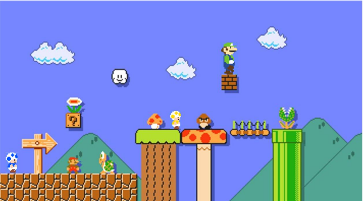

# CC4P1 Programación Concurrente y Distribuida - PC 2

Alumnos:

- De la Cruz Valdiviezo, Pedro Luis David
- Luis Angel Azaña Vega

Mario Bros Multijugador.
Mario Bros. es un videojuego clásico desarrollado por Nintendo y lanzado en 1983. En este juego, los jugadores controlan a Mario, un fontanero, y a su hermano Luigi. El objetivo principal es eliminar a las criaturas que emergen de las tuberías en cada nivel, golpeándolas desde abajo para voltearlas y luego pateándolas para eliminarlas. Este juego se desarrolla en un entorno de plataformas y se juega en una pantalla fija. En 1985, Nintendo lanzó Super Mario Bros, una secuela que se convirtió en uno de los juegos más influyentes de todos los tiempos. En este juego, Mario debe rescatar a la Princesa Peach del villano Bowser en el Reino Champiñón. Los jugadores deben atravesar varios niveles llenos de enemigos y obstáculos, utilizando potenciadores como el Super Champiñón, la Flor de Fuego y la Estrella para ayudar a Mario en su misión

# Objetivo del juego

El objetivo principal de Mario Bros. es eliminar a todas las criaturas que emergen de las tuberías en cada nivel. Los jugadores controlan a Mario y, en el modo multijugador, a su hermano Luigi. Deben evitar que las criaturas lleguen al fondo de la pantalla y se vuelvan más rápidas y peligrosas

# Movimiento y Controles

Movimiento: Mario, Luigi y los Hongos pueden moverse a la izquierda y a la derecha.
Salto: Los personajes pueden saltar para golpear las plataformas desde abajo.
Golpeo: Al golpear las plataformas, los jugadores pueden voltear a las criaturas que están encima.

# Enemigos y obstáculos

Criaturas: Los enemigos incluyen tortugas (Koopas), cangrejos (Sidesteppers) y moscas (Fighter Flies). Cada tipo de criatura tiene un comportamiento diferente. 

Plataformas y Tuberías: Las criaturas emergen de las tuberías y se mueven a lo largo de las plataformas. Los jugadores deben estar atentos a su patrón de movimiento.

Fuego: A medida que avanza el juego, aparecerán bolas de fuego que se mueven a través
de la pantalla y deben ser evitadas.

# Eliminación de criaturas

Voltear y Patear: Para eliminar a una criatura, los jugadores deben golpear la plataforma
desde abajo para voltearla y luego patearla antes de que se recupere.

Puntos: Los jugadores ganan puntos por cada criatura eliminada y por recoger monedas
que aparecen ocasionalmente.

# Puntaje o monedas

Monedas: Recoger monedas otorga puntos adicionales



# Jugadores

Los Jugadores pueden esta representados por Luigi de varios colores, Mario de varios colores o hongos de varios colores. Los jugadores pueden se representados con caracteres:

- Mario M
- Luigi L
- Hongo H

Mario Bros Multijugador
Multijugador

De 1 hasta “r” jugadores pueden enfrentarse en el modo combate, cada jugador puede estar en una pc diferente, conectados en red.

Niveles

Desarrollar un nivel por integrante.

Tablero de puntuación

Agregar un tablero para saber quién comió más monedas.

Adaptar el Mario Bros de modo que en el juego se puede competir contra “r” rivales
humanos que estarán en la red

Desarrollar un modo multijugador, donde varios jugadores (rivales) jueguen entre ellos y contra los otros Jugadores, y donde gana el que consiga comer más monedas y no chocar con sus rivales, objetos o enemigos.
El escenario es extenso y el jugador puede moverse y recorrer por todo el usuario ya sea derecha, izquierda, saltando o bajando. Un jugador puede estar representado con caracteres, por ejemplo.


Debe funcionar en java, y como mínimo en Java 8 com.

Los grupos mayores a 2 agregar dos niveles por integrante adicional, constan de nuevos escenarios como mayor interactividad y velocidad de acuerdo a los niveles.

Para el servidor definir un campo para el puerto y para el cliente definir dos campos de la ip y del puerto

Las tareas de los participantes son:

- No usar websocket, socketio y otras librerías.
- El servidor.
- Los clientes y los diferentes tipos de enemigos.
- La interfaz grafica y ejecutar en red.
- Los grupos que tengan más de dos participantes, desarrollaran 2 escenarios
adicionales por cada participante adicional.

# Solución

Vamos a utilizar IntelliJ IDEA para gestionar el juego y para que varios jugadores puedan jugar a traves de el, para ello planteamos la estructura de nuestro proyecto:

## 1. Estructura del Proyecto

- Modulo del servidor: Gestionara la comunicación entre los jugadores y el control de los niveles
- Módulo del cliente: Representará a los jugadores y se encargará de la lógica del movimiento, recolección de monedas y eliminación de enemigos
- Interfaz Gráfica (GUI): Utilizará Java Swing para representar el juego visualmente
- Conexión de Red: Implementa las clases para la conexión del cliente-servidor utilizando `Socket` y `ServerSocket`

## 2. Client Handle

La clase `ClientHandler` extiende `Runnable` para permitir que cada cliente se ejecute en su propio hilo, permitiendo que el servidor maneje varias conexiones simultáneas.

```java
import java.io.*;
import java.net.*;
import java.util.List;

public class ClientHandler implements Runnable { // Se crea la clase ClientHandler que implementa la interfaz Runnable
    private Socket clientSocket;
    private List<ClientHandler> clients;
    private PrintWriter output;
    private BufferedReader input;
    private String playerName;

    public ClientHandler(Socket socket, List<ClientHandler> clients) throws IOException {
        this.clientSocket = socket;
        this.clients = clients;
        input = new BufferedReader(new InputStreamReader(clientSocket.getInputStream())); // Se crea un buffer de lectura
        output = new PrintWriter(clientSocket.getOutputStream(), true); // Se crea un buffer de escritura
    }

    @Override
    public void run() {
        try {
            output.println("Bienvenido al servidor de Mario Bros. Introduce tu nombre: ");
            playerName = input.readLine(); // Se lee el nombre del jugador
            broadcastMessage(playerName + " se ha unido al juego."); // Se envía un mensaje a todos los jugadores

            String clientMessage;
            while ((clientMessage = input.readLine()) != null) { // Se lee el mensaje del cliente
                handleClientMessage(clientMessage); // Se procesa el mensaje del cliente
            }

        } catch (IOException e) {
            e.printStackTrace();
        } finally {
            try {
                clientSocket.close(); // Se cierra el socket del cliente
                clients.remove(this); // Se elimina el cliente de la lista de clientes
                broadcastMessage(playerName + " ha abandonado el juego."); // Se envía un mensaje a todos los jugadores
            } catch (IOException e) {
                e.printStackTrace();
            }
        }
    }

    private void broadcastMessage(String message) {
        for (ClientHandler client : clients) {
            client.output.println(message); // Se envía el mensaje a todos los clientes
        }
    }

    private void handleClientMessage(String message) {
        System.out.println(playerName + ": " + message); // Se imprime el mensaje en la consola
        broadcastMessage(playerName + ": " + message); // Se envía el mensaje a todos los jugadores
    }

}

```

Explicación:

La clase ClientHandler es responsable de manejar la comunicación con un cliente específico. Implementa Runnable para permitir que cada cliente se ejecute en su propio hilo. Esto facilita que el servidor pueda manejar múltiples conexiones de clientes simultáneamente.

La clase utiliza BufferedReader y PrintWriter para leer y escribir mensajes entre el cliente y el servidor. El método run() maneja la lógica principal del cliente, incluyendo la recepción del nombre del jugador y la transmisión de mensajes a todos los clientes conectados.

### ¿Cómo funciona `ClientHandler`?

- Cuando un nuevo jugador se conecta, se crea un nuevo hilo utilizando `ClientHandler`, y este hilo se ejecuta en paralelo con otros clientes.
- El servidor espera las acciones de los jugadores (movimientos o mensajes) y luego las retransmite a todos los clientes, asegurando que todos vean la misma información sobre el estado del juego.
- Por ejemplo, si un jugador recolecta una moneda o salta, esta acción se puede transmitir a través del servidor a todos los demás jugadores conectados para que vean los mismos cambios en sus pantallas.

## 2. Servidor

- El servidor se encargará de recibir las conexiones de los jugadores, gestionar la lógica del juego y sincronizar el estado de los clientes
- Utiliza `ServerSocket` para crear un servidor que escuche en el puerto definido.
- Maneja el envío de información entre los clientes y el servidor (por ejemplo, las posiciones de los jugadores, las monedas recolectadas, y el estado de los enemigos).

```java
import java.util.*;
import java.io.*;
import java.net.*;

public class MarioServer {
    private static final int PORT = 5684; // Este es el puerto que se va a utilizar para la comunicación
    private static List<ClientHandler> clients = new ArrayList<>(); // Lista de clientes conectados

    public static void main(String[] args) throws IOException {
        try (ServerSocket serverSocket = new ServerSocket(PORT)) { // Se crea el socket del servidor
            System.out.println("Servidor en espera de jugadores...");
            while (true){
                Socket clientSocket = serverSocket.accept(); // Se acepta la conexión de un cliente
                ClientHandler clientHandler = new ClientHandler(clientSocket, clients); // Se crea un nuevo hilo para el cliente
                clients.add(clientHandler); // Se agrega el cliente a la lista de clientes
                new Thread(clientHandler).start(); // Se inicia el hilo del cliente
            }
        } catch (IOException e) {
            System.err.println("Error al abrir el socket del servidor: " + e.getMessage());
        }
    }
}
```

Explicación:

La clase MarioServer es la clase principal del servidor. Esta clase utiliza un ServerSocket para escuchar conexiones entrantes en un puerto específico (en este caso, el puerto 5684). Cuando un cliente se conecta, el servidor crea una nueva instancia de ClientHandler para manejar esa conexión específica. Cada ClientHandler se ejecuta en su propio hilo, permitiendo que el servidor maneje múltiples clientes simultáneamente.

### ¿Cómo funciona `MarioServer`?

- Inicialización: El servidor se inicia y comienza a escuchar conexiones en el puerto especificado (5684).
- Aceptación de conexiones: Cuando un cliente se conecta, el servidor acepta la conexión y crea un nuevo ClientHandler para manejar esa conexión específica.
- Manejo de múltiples clientes: Cada ClientHandler se ejecuta en su propio hilo, permitiendo que el servidor maneje múltiples clientes de forma concurrente. Esto asegura que las acciones de un jugador no bloqueen o ralenticen el juego para otros jugadores.

## 3. Cliente

- El cliente manejará los controles de movimiento y enviará las acciones al servidor.
- El jugador puede moverse en 4 direcciones (izquierda, derecha, saltar y agacharse).
- Para la conexión, el cliente debe especificar la IP y el puerto del servidor.

El cliente se implementará utilizando Java Swing para la interfaz gráfica y sockets para la comunicación con el servidor. A continuación, se muestra un ejemplo básico de cómo podría estructurarse la clase principal del cliente:

```java
import javax.swing.*;
import java.awt.*;
import java.awt.event.*;
import java.io.*;
import java.net.*;

public class MarioClient extends JFrame {
    private static final String SERVER_IP = "localhost"; // IP del servidor
    private static final int SERVER_PORT = 5684; // Puerto del servidor
    private Socket socket; // Socket del cliente
    private PrintWriter out; // Buffer de escritura
    private BufferedReader in; // Buffer de lectura
    private JPanel gamePanel; // Panel del juego
    private int playerX = 0, playerY = 0; // Posición del jugador

    public MarioClient() {
        setTitle("Mario Bros Multijugador");
        setSize(800, 600); // Tamaño de la ventana
        setDefaultCloseOperation(JFrame.EXIT_ON_CLOSE); // Al cerrar la ventana, se cierra el programa

        gamePanel = new JPanel() {
            @Override
            protected void paintComponent(Graphics g) { // Método para dibujar en el panel
                super.paintComponent(g); // Se llama al método paintComponent de la clase padre
                g.setColor(Color.RED); // Se establece el color rojo
                g.fillRect(playerX, playerY, 30, 30); // Se dibuja un rectángulo en la posición del jugador
            }
        };
        add(gamePanel); // Se agrega el panel al frame

        addKeyListener(new KeyAdapter() { // Se agrega un KeyListener al frame
            @Override
            public void keyPressed(KeyEvent e) { // Método que se ejecuta al presionar una tecla
                movePlayer(e.getKeyCode()); // Se mueve el jugador en función de la tecla presionada
            }
        });

        setFocusable(true); // Se establece el foco en el frame

        connectToServer(); // Se conecta al servidor
    }

    private void connectToServer() { 
        try {
            socket = new Socket(SERVER_IP, SERVER_PORT); // Se crea el socket del cliente
            out = new PrintWriter(socket.getOutputStream(), true); // Se crea un buffer de escritura
            in = new BufferedReader(new InputStreamReader(socket.getInputStream())); // Se crea un buffer de lectura

            // Iniciar un hilo para recibir mensajes del servidor
            new Thread(this::receiveMessages).start();

        } catch (IOException e) {
            e.printStackTrace();
        }
    }

    private void movePlayer(int keyCode) {
        switch (keyCode) {
            case KeyEvent.VK_LEFT: // Si se presiona la tecla de la izquierda
                playerX -= 5; // Se mueve el jugador hacia la izquierda
                break;
            case KeyEvent.VK_RIGHT: // Si se presiona la tecla de la derecha
                playerX += 5; // Se mueve el jugador hacia la derecha
                break;
            case KeyEvent.VK_UP: // Si se presiona la tecla de arriba
                playerY -= 5; // Se mueve el jugador hacia arriba
                break;
            case KeyEvent.VK_DOWN: // Si se presiona la tecla de abajo
                playerY += 5; // Se mueve el jugador hacia abajo
                break;
        }
        gamePanel.repaint(); // Se vuelve a pintar el panel
        sendPosition(); // Se envía la posición del jugador al servidor
    }

    private void sendPosition() { // Método para enviar la posición del jugador al servidor
        out.println("MOVE " + playerX + " " + playerY); // Se envía un mensaje al servidor con la posición del jugador
    }

    private void receiveMessages() {
        try {
            String message; // Variable para almacenar los mensajes del servidor
            while ((message = in.readLine()) != null) { // Se lee un mensaje del servidor
                System.out.println("Mensaje del servidor: " + message); 
                // Aquí se procesarían los mensajes del servidor
            }
        } catch (IOException e) {
            e.printStackTrace();
        }
    }

    public static void main(String[] args) {
        // Se crea una instancia de MarioClient y se hace visible
        SwingUtilities.invokeLater(() -> new MarioClient().setVisible(true)); 
    }
}
```

Explicación:

La clase MarioClient es la implementación del cliente para el juego Mario Bros Multijugador. Esta clase extiende JFrame para crear una ventana gráfica y utiliza sockets para la comunicación con el servidor. La clase maneja la interfaz de usuario, los controles del jugador y la sincronización con el servidor.

### ¿Cómo funciona MarioClient?

- Interfaz gráfica: Utiliza Java Swing para crear una ventana con un panel de juego donde se dibuja al jugador.
- Controles: Implementa un KeyListener para capturar las teclas presionadas por el usuario y mover al jugador en consecuencia.

## Primeros pasos

Al ejecutar nuestro programa tendremos lo siguiente:

Al iniciar el servidor, veremos un mensaje indicando que está en espera de jugadores. Cuando ejecutamos el cliente, se abrirá una ventana con un rectángulo rojo representando al jugador. Podemos mover este rectángulo usando las teclas de flecha, y el cliente enviará las actualizaciones de posición al servidor.

Al ejecutar el servidor:


Al ejecutar el cliente:


Cuando presionamos las flechas, el “mario” rojo se mueve y en la parte del cliente nos sale lo siguiente:


y por parte del servidor nos sale:

